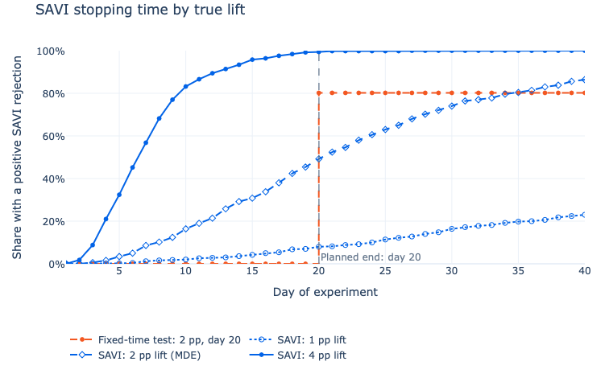

Thanks to help by Michael, the next PyFixest release will ship support for safe anytime-valid inference (SAVI). A new vignette walks through when and why to use it in randomized experiments. If you (or someone in your team) have ever been tempted to ship after an interim p-value crossed the mythical 5% threshold, this might be for you =) You can find the vignette **[here](https://pyfixest.org/how-to/anytime-valid-inference.html)**.

