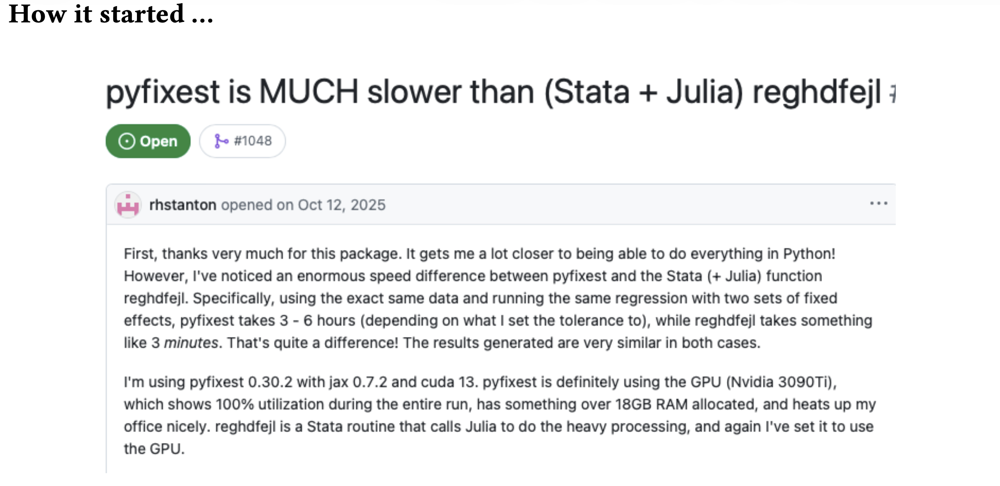
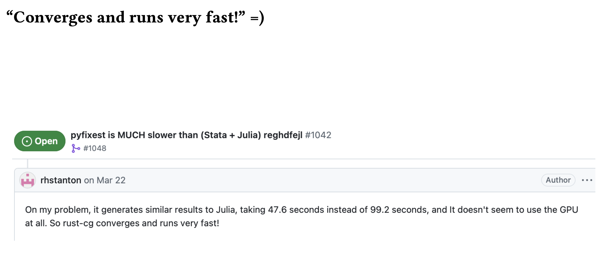
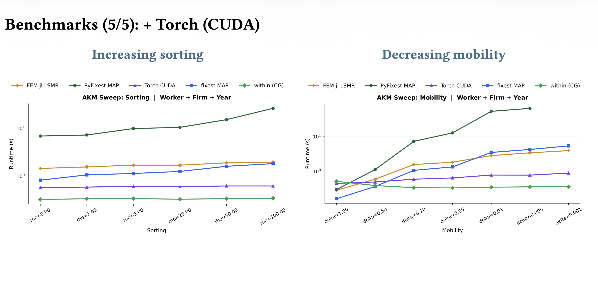

Yesterday I was in Berlin for the day and presented at the local PyData Meetup on our new solver 
for fixed effects regression. It was of course a lot of fun! The development was prompted by 
an issue we received via github a couple of months ago: 

{fig-align="center" width="85%"}

Hours vs minutes! Urgh. Luckily, we've made some progress in between, so the issue could be closed 
with with 

{fig-align="center" width="85%"}

If you are curious how the new solver works, you can find the slides for the talk [here](pydata-berlin-within.pdf), and please make sure to 
take a look at the [code](https://github.com/py-econometrics/within/) or to even run a regression 
with it! We also have a 
longer [write up](https://github.com/py-econometrics/within-paper) up in preparation, but as unfortunately
is too often the case, the Pareto principle bites and we've been refining the last 20% 
for quite a while now. 

{fig-align="center" width="85%"}
