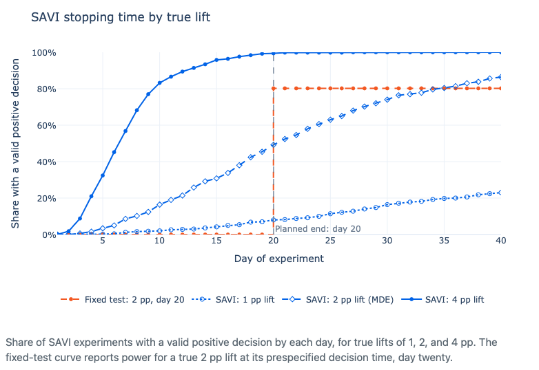

{fig-align="center" width="80%"}

PyFixest 0.70.0 will be out soon, and the headline feature is **safe anytime-valid inference (SAVI)** for linear regression, following [Lindon et al. (2026)](https://doi.org/10.1080/01621459.2026.2692052).

## What SAVI does

Standard p-values and confidence intervals are calibrated for a single, pre-specified analysis. If you peek at an A/B test dashboard daily and stop the first time p < 0.05, the false-positive rate can be far above 5%. SAVI fixes this: it replaces the fixed-time p-value with a **sequential p-value** and the fixed-time confidence interval with a **confidence sequence**. Under the method's assumptions, a 5% SAVI test has an asymptotic 5% bound on the probability of a threshold crossing at any review, and its confidence sequence contains the true effect at every review simultaneously with asymptotic probability of at least 95%. The review schedule does not need to be chosen before launch.

SAVI comes with three equivalent decision rules:

```python
# Rule 1: stop when the sequential p-value ≤ 0.05
fit.pvalue_savi(mixture_precision=mp)

# Rule 2: stop when the e-value ≥ 20 (= 1/0.05)
fit.evalue(mixture_precision=mp)

# Rule 3: stop when zero falls outside the confidence sequence
fit.confint(inference_type="savi", mixture_precision=mp)
```

An associated vignette - **[When to Use Anytime-Valid Inference](https://pyfixest.org/how-to/anytime-valid-inference.html)** — walks through five practical scenarios where SAVI matters: daily A/B test monitoring, effect-size-dependent stopping, making sure that a backend migration does not break anything, long-term holdouts, and canary releases.

## What else is new

- `confint()`, `tidy()`, and `summary()` gain an `inference_type` argument. `confint()` accepts `"regular"`, `"simult"`, or `"savi"`; `tidy()` and `summary()` currently accept only `"regular"`.
- `feglm()` now supports `weights`, `weights_type`, and `offset`, and `family="poisson"`.
- `pf.fepois` gets step-halving, inner-tolerance tightening, and ppmlhdfe-style warm-start acceleration.
- Removed deprecated `fixef_tol`, `fixef_maxiter`, `demeaner_backend` arguments, JAX backend, and `FeolsCompressed`.
- Fixed a bug where `confint()` could mislabel coefficients when `keep` or `drop` reordered them.

Once 0.70.0 is published, install it with:

```
pip install pyfixest --upgrade
```
