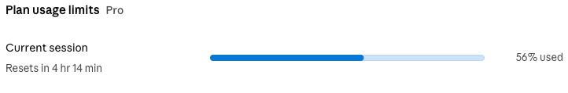
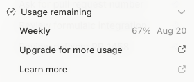

::: {layout-ncol=2}

:::

Usually I don't watch much youtube (a social phenomenon I have somewhat missed out on), but here's an [interesting video](https://www.youtube.com/watch?v=iPUn1Fnfn0k) about another social phenomenon I have somewhat experienced myself . 

With LLM coding, I feel like I can do anything and start working on too many things simultaneously / in multiple parallel sessions (pyfixest features and [refactoring](https://github.com/py-econometrics/pyfixest/pull/1379), [a paper on our new demeaning algo](https://github.com/py-econometrics/within-paper), [R bindings for the new algo](https://github.com/py-econometrics/within/pull/84), [presentations](https://www.meetup.com/de-de/pydata-berlin/events/316084301/?eventOrigin=group_upcoming_events) on this and that, blog posts, a [JOSS paper draft](https://github.com/py-econometrics/pyfixest/pull/1447), etc etc). 

I am paying for subscriptions with Codex, Claude, and OpenCode, and when I don't spend all of my usage, I feel like I missed an opportunity, so sometimes I skip going to the gym to keep on working because I still have usage to spend or usage will reset in 30 minutes so I can keep on ~~working~~ prompting my agents to keep on working... This was particularly bad the weekend that Fable was temporarily available on the 20$ plan - I almost couldn't leave my keyboard, the desire to keep on prompting was too strong. Needless to say that - because I prompted without much thinking - the results I got were not very good. 

I usually start working on OSS after work around 21:00, and suddenly it's 23:30 and I want to stop, but there is one last prompt to write and finally I stop and it is 00:30 but I feel no accomplishment because I haven't been doing any deep work ... but at least, I used all of my usage (#tokenmaxxing = #dopamaxxing)![^dopa] Prior to agentic coding, I'd occasionally also work late, but eventually, I'd be too tired to continue coding. Nowadays, I just continue, on and on, hoping that GTP and Claude will cover / win the lottery for me if I just [keep on encouraging](https://www.anthropic.com/research/riemann-zeta) them enough.

Long story short, I think a more optimal strategy for me going forward is to reduce the number of subscriptions (fewer token limits to hit) and topics I work on in parallel and, to some degree, stop over-relying on an auto-mode-and-review workflow and switch back to a more "socratic" style of coding with LLMs.

[^dopa]: Thanks to Kyle W. for pointing out to me that, in truth, when writing about Token-Maxxing, I had in fact been writing about "Dopa-Maxxing".